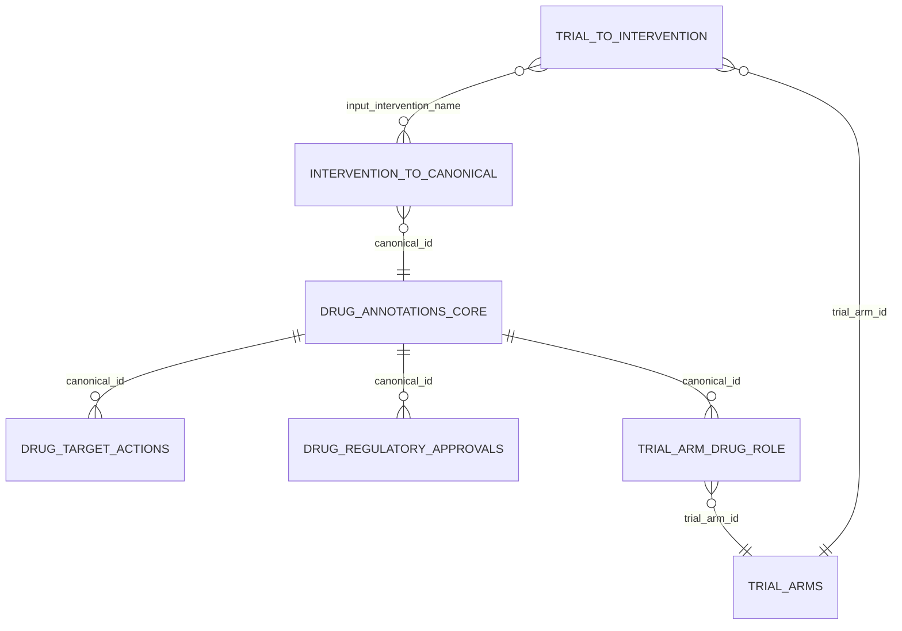

# Drug reference — relational schema & design (spec §6.1)

The drug reference is **six 3NF relational tables**, persisted as TSVs under
`<DATA_ROOT>/drug_annotations/current_version/` (superseded builds go to `drug_annotations/archive/`). All data paths
derive from one relocatable `DATA_ROOT` constant (`core/paths.py`; = `data/agentic/` today, promotable to `data/`).
The tables split into stages that mirror the build workflow:

- **Stage 1 — drug identity** ("*which drug is this?*"): resolve each trial's raw intervention string to a canonical
  drug, and record which trials used it. Tables: `trial_to_intervention`, `intervention_to_canonical`.
- **Stage 2 — drug enrichment** ("*what is this drug?*"): the intrinsic, trial-independent facts about each canonical
  drug. Tables: `drug_annotations_core`, `drug_target_actions`, `drug_regulatory_approvals`.
- **Phase 2 — drug role** ("*what part does this drug play in this arm?*"): the **main** (investigational/defining)
  vs. **auxiliary** (backbone/SoC/comparator/placebo) role of each drug within each trial arm — a contextual,
  per-(arm × drug) fact, so it lives in its own table `trial_arm_drug_role`, NOT on the intrinsic drug facts.

---

## Why 3NF (the design decision)

Third normal form means **every fact lives in exactly one place, keyed by the thing it actually depends on** — no
column depends on anything other than the whole key of its table. Concretely:

1. **A drug's intrinsic facts depend only on the drug — not on the trial or the raw string.** Pembrolizumab's
   modality, class, targets and TGA/PBS approvals are the same no matter which of the 50 trials names it, or whether
   a registry wrote "Keytruda", "MK-3475" or "pembrolizumab". So those facts live **once** in `drug_annotations_core` /
   `drug_target_actions` / `drug_regulatory_approvals`, keyed by `canonical_id`, and every trial that uses the drug is a **pure
   lookup**. A flat "one row per (trial × drug)" table would instead store pembrolizumab's facts hundreds of times.

2. **No update / inconsistency anomalies.** Re-researching a drug updates one row and every reference sees it. In a
   denormalized table you'd have to find and update every copy, and any miss leaves the data contradicting itself.

3. **The build-efficiency win is a direct consequence.** Because identity and facts are separated and deduplicated,
   the expensive LLM + web-search work runs **once per distinct drug** (e.g. ~2,400 raw tokens → ~1,300 canonicals
   researched once), and re-runs of the universe are lookups. Normalization is what makes that possible.

4. **Repeating groups become child tables, not stuffed cells.** A drug has *many* molecular targets and *many*
   approved indications (one-to-many). 3NF puts each in its own child table (`drug_target_actions`, `drug_regulatory_approvals`), one
   row per item — queryable (`WHERE target = 'PD-1'`) instead of parsing a `;`-joined blob.

5. **Identity vs. provenance are different dependencies, so they're different tables.** The raw-string → canonical
   mapping depends on the *string* (stable across trials) → `intervention_to_canonical`, deduped by string. Which
   *trials* used a string is a separate many-to-many → `trial_to_intervention`. Splitting them keeps the mapping
   computed once and reused by every trial occurrence.

### Yes — this is explicitly built to be SQL-ready and query-efficient

The tables *are* relational tables: each TSV loads directly into SQL / DuckDB / pandas as one table, and the shared
keys are the join keys. The design was chosen so that questions become **clean joins + filters** instead of
string-parsing a wide flat file, and so an index on `canonical_id` / `input_intervention_name` makes them fast:

- `canonical_id` is a **namespaced, uniform-type key** (`rxcui:<n>` when RxNorm-resolved, else `name:<x>`) — a
  clean primary/foreign key with no int/string mixing.
- `input_intervention_name` is the natural key linking the two stage-1 tables.

**Example queries the schema makes trivial:**
```sql
-- Every trial studying a PD-1 inhibitor
SELECT DISTINCT t.trialId, t.registry
FROM drug_target_actions g
JOIN intervention_to_canonical i ON i.canonical_id = g.canonical_id
JOIN trial_to_intervention   t ON t.input_intervention_name = i.input_intervention_name
WHERE g.target = 'PD-1';

-- Is a drug TGA-approved for melanoma, and since when?
SELECT r.canonical_name, d.tga_status, d.tga_date, d.tga_evidence_url
FROM drug_regulatory_approvals d JOIN drug_annotations_core r USING (canonical_id)
WHERE d.cancer_type ILIKE '%melanoma%' AND d.tga_status = 'approved';

-- Distinct drugs across the ANZCTR universe
SELECT DISTINCT r.canonical_name
FROM trial_to_intervention t
JOIN intervention_to_canonical i USING (input_intervention_name)
JOIN drug_annotations_core r USING (canonical_id)
WHERE t.registry = 'anzctr';
```

The normalized tables are the **masters**; a denormalized, self-contained **flat view** (one row per canonical
with targets/indications collapsed into cells) can be *materialized* on top for consumers who want a single flat
file — the same "normalized masters + combined view" pattern the trial pipeline uses. The drug build currently
emits **only the 3NF masters** (`current_version/` holds no combined view); should a `drug_ref_combined.tsv` be
materialized, it — like the trial pipeline's `combined.tsv` — is a denormalized join and is kept **outside** the
`current_version/` store dir, which holds pure-3NF tables only.

---

## The six tables

### Stage 1 — drug identity

**`intervention_to_canonical`** — the mapping. Grain: one row per (input string × canonical drug); a combination
splits `1 input → N` rows; a non-drug is one row with an empty `canonical_id`. Deduped by the input string.

| column | meaning |
|---|---|
| `input_intervention_name` | the intervention name exactly as written in the registry (lookup key) |
| `raw_name_to_map` | the fragment of the input that names *this* canonical (`Palbociclib` from `Arm A: Gedatolisib + Palbociclib + Fulvestrant`; the drug name minus dose/arm/setting noise; the whole code when the code *is* the drug) |
| `canonical_id` | FK → `drug_annotations_core.canonical_id` (`rxcui:<n>` \| `name:<x>`); empty for a non-drug |

**`trial_to_intervention`** — the provenance / traceability record. Grain: one row per (trial arm × input
string); many-to-many (a string can appear in many arms; a trial arm has many interventions). The arm identity
(trialId / registry / arm label / arm_type) lives ONCE in the **shared `trial_arms` registry**
(`<DATA_ROOT>/trial_arms/`; `trial_arm_id, trialId, registry, arm, arm_type`, both registries, populated by the
shared cohort-identification module); this table links to it by `trial_arm_id` (a deterministic `{trialId}::{arm}`
slug). Both the drug and eligibility paths reference `trial_arms` — it is the single arm join key.

| column | meaning |
|---|---|
| `trial_arm_id` | FK → shared `trial_arms.trial_arm_id` (the `{trialId}::{arm}` slug) |
| `input_intervention_name` | FK → `intervention_to_canonical.input_intervention_name` |

### Stage 2 — drug enrichment (keyed by `canonical_id`)

**`drug_annotations_core`** — one row per canonical drug; its intrinsic, trial-independent facts. PK: `canonical_id`.

| column | meaning |
|---|---|
| `canonical_id` | PK (`rxcui:<n>` \| `name:<x>`) |
| `canonical_name` | RxNorm ingredient / best canonical name |
| `rxcui` | RxNorm identity (deterministic lookup); "" if none — means "in RxNorm", **not** "approved" |
| `aliases` | `\|`-joined brand / synonym / code names |
| `modality` | one of a controlled vocabulary (small molecule, mAb, ADC, bispecific, …) |
| `drug_class` | general class (e.g. "PARP inhibitor") |
| `pottr_drug_class` | POTTR hierarchy root→leaf (deterministic lookup); "" if not in POTTR |
| `atc_code` | WHO ATC code (deterministic lookup) |
| `fda_status` / `ema_status` | coarse `<status> (<year>): <detail> \| …` summaries |
| `sources` | per-fact citations |
| `researched_on` | ISO date last researched (drives incremental / staleness) |

**`drug_target_actions`** — the mechanism as (target, action) **pairs**; one row per target (a multi-target drug or an ADC
has several). FK: `canonical_id`.

| column | meaning |
|---|---|
| `canonical_id` | FK → `drug_annotations_core` |
| `target` | molecule / pathway, e.g. `PD-1`, `TOP1`, `B7-H3` (the queryable matching dimension) |
| `action` | inhibitor / antagonist / agonist / degrader / ADC-binding / … |
| `note` | nuance ("payload", "antigen", "dual") |

**`drug_regulatory_approvals`** — one row per approved indication, as the regulator states it, decomposed into static fields +
per-agency TGA/PBS approval. Key: `(canonical_id, indication_id)`.

| column group | columns |
|---|---|
| key | `canonical_id` (FK), `indication_id` (surrogate, unique within a drug) |
| as-stated profile | `indication_raw`, `cancer_type`, `biomarker`, `stage`, `line_of_therapy`, `prior_therapy`, `combination`, `setting`, `patient_population` |
| TGA | `tga_status` (approved/not_approved/unknown), `tga_date`, `tga_evidence_url` |
| PBS | `pbs_status`, `pbs_date`, `pbs_evidence_url` |
| | `researched_on` |

### Phase 2 — drug role (keyed by `(trial_arm_id, canonical_id)`)

**`trial_arm_drug_role`** — the role each drug plays *within a specific trial arm*. Grain: one row per (trial arm ×
canonical drug). This is a **contextual** fact — the same drug can be `main` (investigational) in one arm and
`auxiliary` (backbone) in another — so it depends on the *whole* `(arm, drug)` key and cannot live on the intrinsic
`drug_annotations_core`. It is deliberately **not** a column on `trial_to_intervention`: that table is keyed by the
raw input *string*, and ~11% of input strings bundle several drugs of differing roles (e.g. `Arm A: Gedatolisib +
Palbociclib + Fulvestrant` = one investigational + two backbone). Kept at canonical grain, it joins directly to
`drug_regulatory_approvals` on `canonical_id` for **per-main TGA/PBS**.

| column | meaning |
|---|---|
| `trial_arm_id` | FK → shared `trial_arms.trial_arm_id` (the `{trialId}::{arm}` slug) |
| `canonical_id` | FK → `drug_annotations_core.canonical_id` |
| `role` | `main` (investigational/defining agent under study) \| `auxiliary` (backbone / SoC / comparator / placebo / premedication) |

**Consistency contract:** every `(trial_arm_id, canonical_id)` is derivable from `trial_to_intervention ⋈
intervention_to_canonical` (no orphan roles); every derived (arm, drug) pair with a non-empty `canonical_id` gets
exactly one role row; non-drug inputs (empty `canonical_id`) get no row; a `--from-trials` rebuild drops a trial's
role rows before re-deriving (overwrite symmetry with `trial_to_intervention`). Both FK edges are checked by
`make agentic-arm-consistency` (the `trial_arm_id` refs) — a dangling `trial_arm_id` is reported as `role_dangling`.

---

## How they relate



- **`trial_to_intervention` ↔ `intervention_to_canonical`** — joined on `input_intervention_name` (many-to-many): a
  trial reaches its drugs by looking up each of its intervention strings.
- **`intervention_to_canonical` → `drug_annotations_core`** — many mapping rows point at one drug via `canonical_id`.
- **`drug_annotations_core` → `drug_target_actions` / `drug_regulatory_approvals`** — one drug has many target rows and many indication rows.
- **`trial_arm_drug_role`** sits at the join of `trial_to_intervention ⋈ intervention_to_canonical` (the arm × drug
  relation), adding the `role` attribute; it FKs to `trial_arms` (`trial_arm_id`) and `drug_annotations_core` (`canonical_id`).

The join path **trial → drug facts** is:
`trial_to_intervention` → (`input_intervention_name`) → `intervention_to_canonical` → (`canonical_id`) →
`drug_annotations_core` → (`canonical_id`) → `drug_target_actions` / `drug_regulatory_approvals`.
The **main drug + its per-main TGA/PBS** for an arm is:
`trial_arm_drug_role` (WHERE role='main') → (`canonical_id`) → `drug_regulatory_approvals`.

---

## How each table is produced and reviewed

Every table with judgement in it is produced by a **doer → reviewer** pair (spec §5); the deterministic tables/
fields have no reviewer because there is no judgement to check.

**The doer → reviewer contract (shared by all three LLM stages):**
- The **doer** is the sole writer. It generates the artifact (with `web_search` for the identity/enrichment/
  approval stages).
- The **reviewer** only *advises*: it returns a `ReviewVerdict` = `faithful` (bool) + `problems` (a list of
  concrete issues) — **never a rewritten artifact**. Verifying is easier than generating, so the reviewer catches
  what the doer missed.
- On `faithful=false`, `refine()` feeds the problems **back to the doer**, which re-generates (bounded loop,
  `max_attempts ≈ 3`). So no unreviewed value ever reaches the output, and every accepted value was re-checked
  *after* it was (re)written. The reviewer does **not** re-run the web search — it judges plausibility.
- **Deterministic guards run alongside the reviewer** and feed problems back the same way (a controlled-vocabulary
  or format violation fails the check before/independently of the LLM reviewer).
- **Deterministic *facts* are not reviewed at all** — `rxcui` + `atc_code` (RxNorm RRF), `pottr_drug_class` (POTTR
  ontology), and the whole `trial_to_intervention` provenance come from primary data/lookups, not LLM judgement, so
  there is nothing to adversarially check.

### `intervention_to_canonical` — canonicalizer + `drug_canonicalizer_reviewer`
- **Doer** (`drug_canonicalizer`, web search): raw name → `components` (canonical_name, raw_name_to_map, aliases,
  is_investigational).
- **Deterministic guard** (`_COMBO_LEFTOVER`): rejects any component whose `canonical_name` still contains a
  join word (`+ / ; & or and plus`) — a combination that was not split — before the reviewer even runs.
- **Reviewer verifies:**
  - **Split correctness** — a multi-drug regimen/combination is split into *all* its component drugs; a single
    molecular entity (ADC, bispecific/trispecific, fusion) is kept as **one**; a named regimen (FOLFOX/R-CHOP) is
    expanded; a comma-separated *list of drugs* (`anastrozole, exemestane, letrozole`) is split, **but** a
    descriptive comma of one drug (`immune globulin, human`) is **kept as one**.
  - **Correct identity** — each `canonical_name` is the right ingredient/INN (brand & code names resolved, salt/
    formulation reduced to base), with no leftover join word (including a drug-joining comma).
  - `is_investigational` set correctly per component; a **non-drug** yields an empty component list.
  - **No fabrication from a generic word** — flags any specific agent invented from `chemotherapy` / `standard of
    care` / `immunotherapy` (e.g. returning vincristine + cyclophosphamide from the bare word "chemotherapy").
- *(`rxcui` is then a deterministic RxNorm lookup on the accepted name — not reviewed.)*

### `trial_to_intervention` — deterministic, **no reviewer**
Which trial + registry + arm (label and type) each input name came from is recorded at collection time (the loader
knows it), so it is a pure deterministic fact — no doer, no reviewer. Its integrity is a property of the collection
code, not a judgement.

### `drug_annotations_core` + `drug_target_actions` — annotator + `drug_annotator_reviewer`
Both tables come from the **one** `annotate` call (the scalar facts land in `drug_annotations_core`; the
(target, action) rows become `drug_target_actions`), so one reviewer covers both.
- **Doer** (`drug_annotator`, web search): `modality`, `targets` (target/action pairs), `drug_class`,
  `fda_status`, `ema_status`, `sources`.
- **Deterministic guard**: `modality` must be exactly one term from the controlled `MODALITIES` vocabulary.
- **Reviewer verifies:**
  - `modality` is exactly one valid term **and** correct for the drug.
  - the **(target, action) pairs are correct AND complete** — each target has the right action; a multi-target
    drug lists all its targets; an **ADC has both** the antigen pair (`ADC-binding`, note=`antigen`) and the
    payload-target pair (note=`payload`).
  - `drug_class` is sensible; `fda_status`/`ema_status` are coarse, correctly formatted
    (`<status> (<year>): <detail> | …`, no `;`), and correct; `sources` are present.
- *(`pottr_drug_class` + `atc_code` are deterministic lookups added after — not reviewed.)*

### `drug_regulatory_approvals` — approvals agent + `drug_approval_reviewer`
- **Doer** (`drug_approval`, web search on official `tga.gov.au` / `pbs.gov.au`): one entry per distinct oncology
  indication — the as-stated profile (cancer_type/biomarker/stage/line/prior/combination/setting/population) plus
  per-agency TGA & PBS status/date/evidence.
- **Deterministic guard**: each `tga_status`/`pbs_status` must be `approved` / `not_approved` / `unknown`.
- **Reviewer verifies:**
  - **Right specificity** — the biomarker qualifier (PD-L1 level, HER2, MSI-H) and any combination/line
    restriction are **not dropped** (approving "melanoma" when the label says "melanoma with BRAF V600E" is wrong).
  - each asserted status carries an **official evidence link**; **TGA and PBS are set independently** (a drug can
    be TGA-approved but not PBS-listed for the same indication).
  - an **investigational / non-approved** drug yields an **empty** list — no invented approvals.
  - flags a dropped qualifier, a missing evidence link on an asserted approval, or a non-oncology indication.
- **Draft posture:** these fields are LLM + live-web-search derived, so they are treated as **draft pending human
  review** — the reviewer raises the floor but does not make them authoritative (a deterministic
  official-source-domain check on the evidence URLs is a planned QA hardening).

### `trial_arm_drug_role` — role classifier + `drug_role_reviewer` (Phase 2, **no web search**)
Runs **once per trial arm** (not per drug), after Stage 1/2 so each drug's canonical identity + class are known.
Cheap judgement from the arm context alone — no web search.
- **Doer** (`drug_role_classifier`): given the arm (label, arm_type, description) + its drugs (canonical_id,
  canonical_name, drug_class, modality), assign each drug `main` or `auxiliary`. main = the investigational/defining
  agent(s) under study (usually the experimental-arm/title drug, or a novel agent with no marketed form —
  `canonical_id` starting `name:` is a strong signal); auxiliary = comparator / chemo backbone / SoC / placebo /
  premedication. `arm_type` is a strong signal (an ACTIVE/PLACEBO_COMPARATOR arm is typically all-auxiliary).
- **Deterministic guard**: every given `canonical_id` gets exactly one assignment (none invented, dropped, or
  duplicated) and every `role ∈ {main, auxiliary}` — checked before the reviewer.
- **Reviewer verifies:** the investigational agent(s) are `main`, genuine backbone/SoC/comparator/placebo are
  `auxiliary`, and a control arm is not given a spurious `main`.

### At a glance

| table | doer (LLM) | deterministic guard | reviewer |
|---|---|---|---|
| `intervention_to_canonical` | canonicalizer (web) | `_COMBO_LEFTOVER` (unsplit join word) | split · identity/INN · investigational · non-drug=empty · no generic-word fabrication |
| `trial_to_intervention` | — (deterministic) | — | — (no judgement) |
| `drug_annotations_core` + `drug_target_actions` | annotator (web) | `modality ∈ MODALITIES` | modality · targets correct **and complete** (ADC antigen+payload) · class · FDA/EMA format · sources |
| `drug_regulatory_approvals` | approvals (web) | status ∈ {approved, not_approved, unknown} | specificity (no dropped qualifier) · status+evidence link · TGA/PBS independent · investigational=empty |
| `trial_arm_drug_role` | role classifier (no web) | every drug labelled once · `role ∈ {main, auxiliary}` | investigational=main · backbone/SoC/comparator/placebo=auxiliary · control arm not spuriously main |
